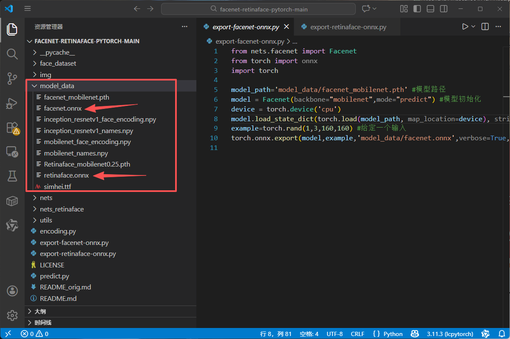

# retinaface_facenet转换工具(pth->onnx)

**注：本仓库基于：[bubbliiiing/facenet-retinaface-pytorch: 这是一个利用facenet和retinaface实现人脸识别的库，可以进行在线的人脸识别。](https://github.com/bubbliiiing/facenet-retinaface-pytorch)修改**

**在此感谢该作者，训练参照原作者即可。**

retinaface和facenet模型的转换

转换脚本运行：

```bash
python export-retinaface-onnx.py
```

```
python export-facenet-onnx
```

即可在model_data目录下得到对应的模型

